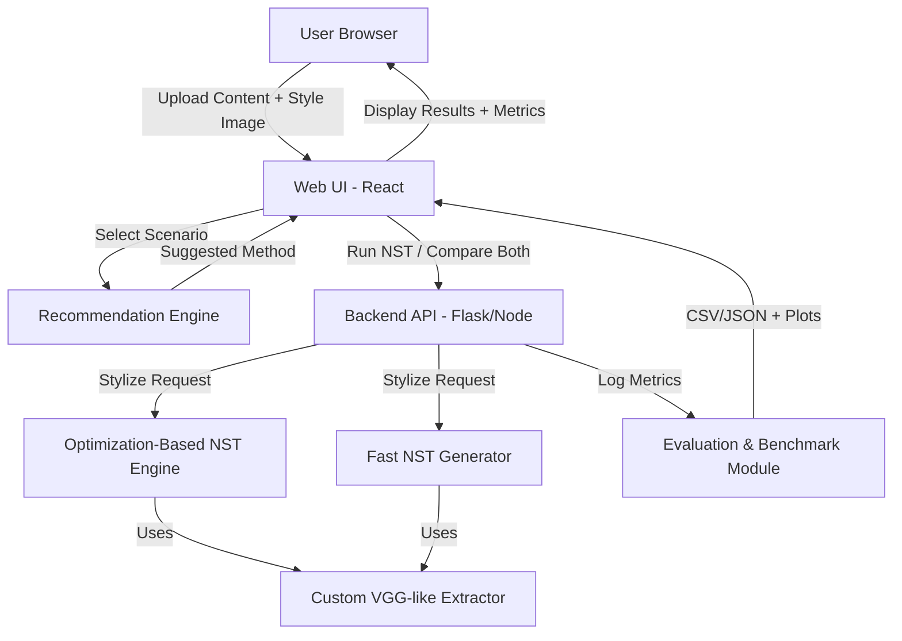

# Architecture Diagram — StyleSense

## System Overview (Mermaid)

## Module Descriptions

| Module | Tech | Owner |
|---|---|---|
| Web UI | React (MERN) | Manas |
| Backend API | Flask / Node.js | Shubhansh |
| Custom Feature Extractor | PyTorch CNN | Shubhansh |
| Optimization-Based NST | PyTorch | Shubhansh |
| Fast NST Generator | PyTorch | Shubhansh |
| Evaluation & Benchmark | Python (pandas, matplotlib) | Both |
| Recommendation Engine | Python (rules-based) | Manas |

## API Endpoints (planned)

| Endpoint | Method | Description |
|---|---|---|
| /api/stylize | POST | Run NST (method: opt/fast/both) |
| /api/benchmark | POST | Run benchmark on test set |
| /api/recommend | POST | Get method recommendation |
| /api/status | GET | Server health check |
